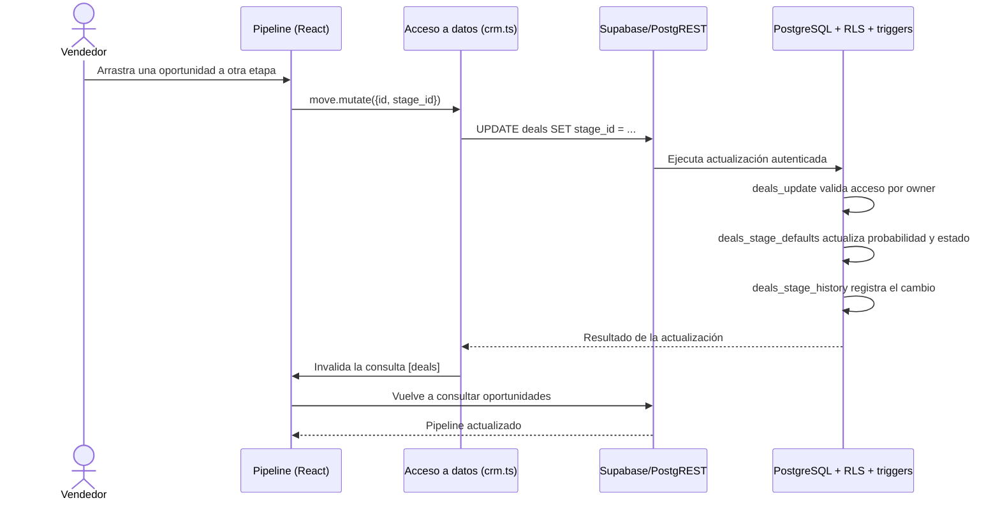

# 18 — Evidencia de participación: Carlos Correa

**Integrante:** Carlos Correa

**Identidad Git:** `CarlitosSaless`

**Correo canónico:** `313083763+CarlitosSaless@users.noreply.github.com`

**Fecha de auditoría:** 18/09/2026

## Propósito

Este documento deja una evidencia reproducible de la participación de Carlos Correa y registra una revisión arquitectónica concreta del flujo **mover una oportunidad de etapa**. Separa explícitamente tres cosas que Git no debe confundir:

1. autoría de un cambio;
2. integración de cambios mediante un merge;
3. auditoría técnica posterior de una decisión arquitectónica.

No se reescribe el historial ni se atribuyen a Carlos commits creados por otros integrantes.

## 1. Normalización de identidad

Los tres commits históricos de Carlos usaron el correo privado de Apple `pvh7dcnmjw@privaterelay.appleid.com`. Los nuevos commits usan el correo privado verificado de GitHub `313083763+CarlitosSaless@users.noreply.github.com`.

El archivo `.mailmap` relaciona ambos correos con una sola identidad para que los reportes locales no presenten a Carlos como dos personas diferentes. Esta normalización **no modifica autores ni hashes históricos**.

Comandos de comprobación:

```bash
git config --local user.name
git config --local user.email
git shortlog -sne --all
git log --all --use-mailmap --author="CarlitosSaless" \
  --pretty=format:"%h | %ad | %an <%ae> | %s" --date=short
```

## 2. Evidencia histórica encontrada

La auditoría encontró tres merges realizados por `CarlitosSaless` el 28/08/2026:

| Commit | Acción verificable | Archivos incorporados frente al primer padre |
|---|---|---|
| `60243eb` | Integró el PR #16, escenario de usabilidad | `dossier/LOG-EDAV-auditoria-ia.md` |
| `b87b4ea` | Integró el PR #17, cierre del README | `dossier/README.md` |
| `0d44b6a` | Integró el PR #18, auditoría de riesgos y drivers | `dossier/01-contexto-y-drivers.md`, `dossier/LOG-EDAV-auditoria-ia.md` |

Estos commits prueban actividad de **integración**. No prueban que Carlos haya escrito los commits internos de esos pull requests. Para inspeccionar de forma correcta qué incorporó cada merge se usa la comparación contra su primer padre:

```bash
git diff --name-status 60243eb^1 60243eb
git diff --name-status b87b4ea^1 b87b4ea
git diff --name-status 0d44b6a^1 0d44b6a
```

## 3. Evidencia arquitectónica producida en esta revisión

### Pregunta auditada

¿Qué componentes participan cuando un vendedor arrastra una oportunidad a otra etapa y dónde se aplican las reglas de negocio y de seguridad?

### Recorrido observable



### Componentes y archivos comprobados

| Nivel C4 | Componente | Responsabilidad observable | Evidencia concreta |
|---|---|---|---|
| Nivel 3 — aplicación web | Pipeline de oportunidades | Detecta el `drop` y solicita el cambio de `stage_id` | `src/routes/_authenticated/pipeline.tsx` |
| Nivel 3 — aplicación web | Acceso a datos del CRM | Ejecuta el `UPDATE` en `deals` e invalida la consulta para refrescar la interfaz | `src/lib/crm.ts` (`useMoveDeal`) |
| Nivel 3 — aplicación web | Cliente Supabase | Configura la conexión de la aplicación con Supabase | `src/integrations/supabase/client.ts` |
| Nivel 3 — backend Supabase | Control de acceso RLS | Permite actualizar solamente las oportunidades cuyo propietario sea accesible para el usuario | `supabase/migrations/20260805035001_05269e6f-a1a0-41ee-9053-ba7d49685ade.sql` (`deals_update`) |
| Nivel 3 — backend Supabase | Reglas y trazabilidad de etapas | Ajusta probabilidad/estado y registra el cambio de etapa | El mismo archivo de migración (`apply_deal_stage_defaults`, `handle_deal_stage_change`) |

### Resultado de la auditoría

- La interfaz no decide por sí sola si la oportunidad queda ganada, perdida o abierta; esa regla observable está implementada en el trigger PostgreSQL `apply_deal_stage_defaults`.
- El cambio no depende únicamente de ocultar controles en React. La política RLS `deals_update` vuelve a validar el acceso en la base de datos.
- Cada cambio de etapa queda registrado por `handle_deal_stage_change` en `deal_stage_history` con usuario y fecha.
- Después de una actualización exitosa, `useMoveDeal` invalida la clave `deals`; esto hace que la interfaz vuelva a consultar y muestre el estado persistido.
- Esta revisión confirma la separación descrita en el C4: interacción y coordinación en la aplicación web; persistencia, seguridad y reglas ligadas a los datos en Supabase.

## 4. Participación trazable a partir de esta entrega

La contribución representativa de Carlos es:

- normalizar sus dos correos Git mediante `.mailmap`, sin alterar el historial;
- auditar los tres merges históricos y distinguir integración de autoría;
- producir la trazabilidad del flujo de cambio de etapa entre los componentes C4;
- verificar en código la política RLS, los triggers de negocio y el registro histórico involucrados.

Archivos producidos o modificados por esta entrega:

- `.mailmap`;
- `dossier/18-evidencia-participacion-carlos-correa.md`.

## 5. Comandos para la defensa

### Volumen por autor

```bash
git shortlog -sne --all
```

### Commits de Carlos

```bash
git log --all --use-mailmap --author="CarlitosSaless" \
  --pretty=format:"%h | %ad | %an <%ae> | %s" --date=short
```

### Archivos modificados por Carlos

```bash
git log --all --use-mailmap --author="CarlitosSaless" --name-status
```

### Participación en orden cronológico

```bash
git log --all --reverse --use-mailmap --author="CarlitosSaless" \
  --pretty=format:"%ad | %h | %an | %s" --date=short
```

### Ver esta evidencia concreta

```bash
git show --stat --name-status HEAD
git show HEAD:dossier/18-evidencia-participacion-carlos-correa.md
```

## Respuesta breve para exposición

> Mis commits anteriores eran tres merges y estaban asociados a un correo privado de Apple. No reescribí el historial ni reclamé código de otros. Normalicé mis alias con `.mailmap` y realicé una contribución propia y defendible: audité el recorrido completo para mover una oportunidad. Verifiqué que React captura la acción, `useMoveDeal` ejecuta la actualización y Supabase aplica RLS, ajusta el estado mediante un trigger y registra el cambio de etapa. La evidencia está vinculada a archivos concretos y puede reproducirse con los comandos de este documento.
