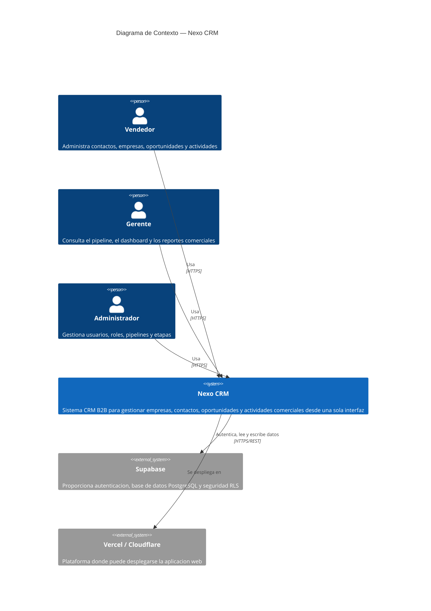
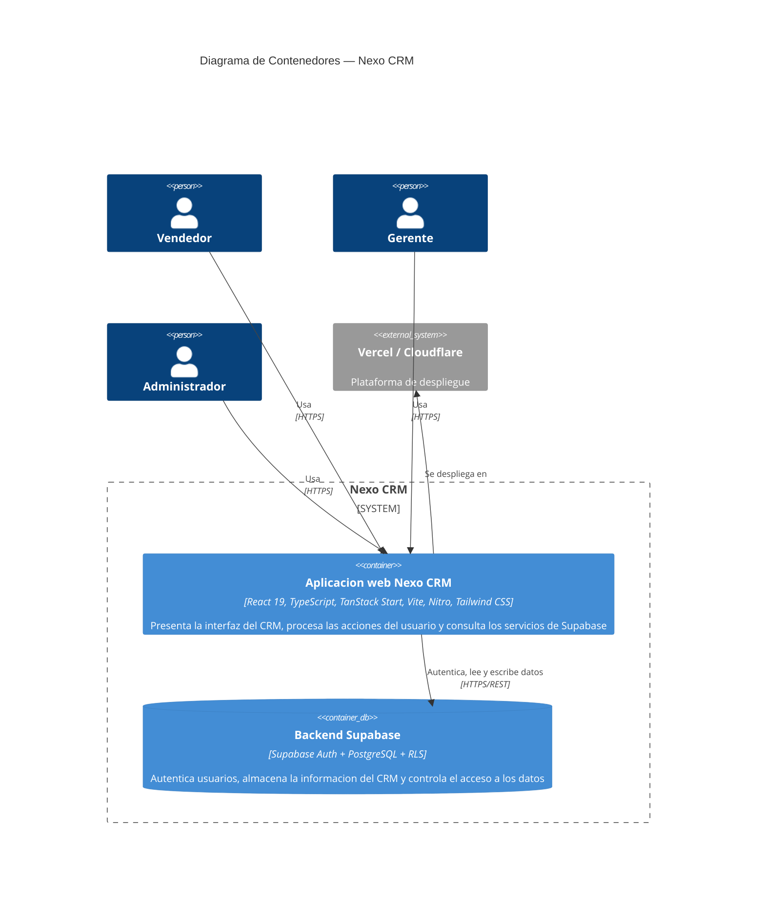
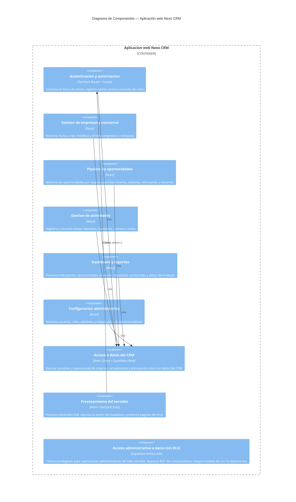
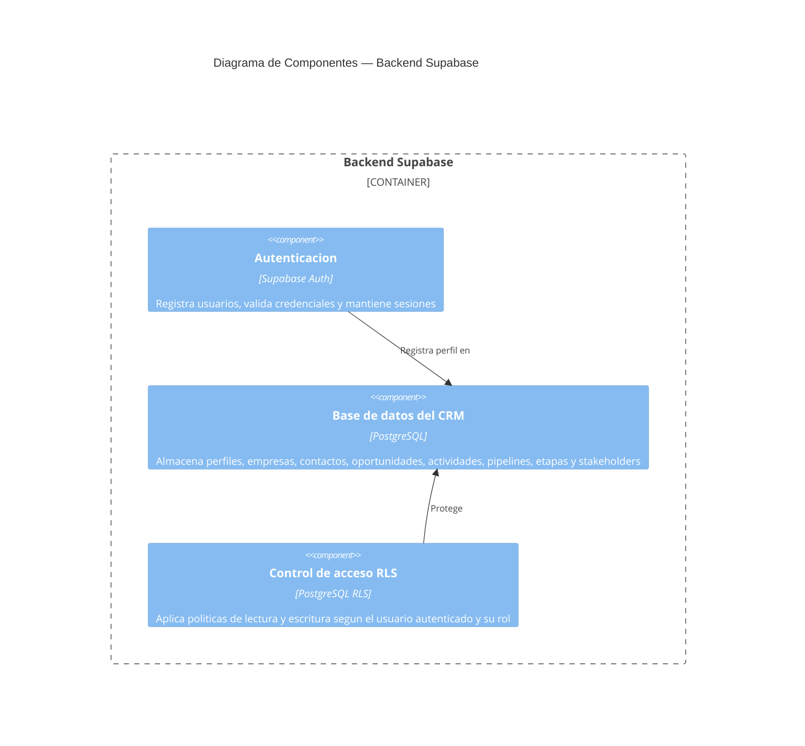

# 03 — Vistas C4 (as-is)

> Diagrama **as-is**: representa la arquitectura que existe hoy y puede demostrarse en el código. Cada elemento tiene un ancla verificable en el repositorio — nada de lo que "nos gustaría tener". Contenido y decisiones de frontera son del equipo; verificación de trazabilidad (que cada archivo citado exista de verdad) corrida el 28/08/2026 y re-corrida el 15/09/2026.

## Audiencia y propósito de cada vista

`[COMPLETAR — EQUIPO]` Una vista que no declara para quién es y qué decisión ayuda a tomar, decora en vez de comunicar. Los stakeholders ya identificados en `01-contexto-y-drivers.md` son: equipo (3 integrantes), usuarios comerciales, dueño del proyecto Supabase, docente, y proveedores externos (Supabase / Vercel).

| Vista | ¿Para quién es? | ¿Qué pregunta responde / qué decisión habilita? | ¿Qué deja deliberadamente afuera? |
|---|---|---|---|
| Nivel 1 — Contexto | **Quien tiene que entender el sistema sin conocerlo por dentro**; hoy, concretamente, el docente y el comité técnico | `[BORRADOR — CONFIRMAR]` Qué alcance tiene el sistema y de qué depende para funcionar, antes de discutir cualquier decisión interna. En particular, qué queda fuera del control del equipo (Supabase, Vercel) | `[BORRADOR — CONFIRMAR]` Toda la estructura interna: no dice en cuántas piezas se despliega ni cómo está organizado el código |
| Nivel 2 — Contenedores | **Quien va a tocar el código** | `[BORRADOR — CONFIRMAR]` En qué pieza desplegable hay que intervenir y qué se despliega junto con qué. Responde explícitamente que **no existe un backend Node separado** donde ubicar lógica de servidor: esa lógica viaja con la app web | `[BORRADOR — CONFIRMAR]` La organización interna de cada contenedor (eso es el Nivel 3) y el esquema de la base de datos |
| Nivel 3 — Componentes (app web) | **Quien va a tocar el código**: integrantes actuales del equipo y cualquier persona que se sume al proyecto | `[BORRADOR — CONFIRMAR]` Dónde hay que intervenir para modificar una funcionalidad, y con qué riesgo se toca cada zona | `[BORRADOR — CONFIRMAR]` El recorrido punto a punto de una petición, las utilidades transversales (`src/lib/format.ts`, `src/lib/utils.ts`) y el detalle de las políticas RLS |
| Nivel 3 — Componentes (backend Supabase) | **Quien va a tocar el código** (misma audiencia que la vista anterior) | `[BORRADOR — CONFIRMAR]` Qué responsabilidades viven del lado de Supabase y no en la app | `[BORRADOR — CONFIRMAR]` Las políticas RLS una por una y el esquema de tablas en detalle |

> Criterio derivado de esta decisión: si la vista de componentes es para quien va a tocar el código, entonces **todo archivo que esa persona se vaya a encontrar debe estar representado**, aunque hoy no lo ejecute ningún flujo. De ahí sale la resolución del caso `client.server.ts` (ver abajo).

> `[BORRADOR — CONFIRMAR]` Por qué el Nivel 2 y el Nivel 3 comparten audiencia y aun así son dos vistas: le responden preguntas distintas a la misma persona. El Nivel 2 responde *"¿en qué pieza desplegable intervengo?"* — y su respuesta más importante es que solo hay dos piezas, sin backend propio. El Nivel 3 responde *"¿en qué parte del código de esa pieza intervengo?"*. Colapsarlas en una sola vista obligaría a mezclar fronteras de despliegue con fronteras de código.

## Nivel 1 — Contexto

Nexo CRM — Sistema CRM B2B que permite gestionar empresas, contactos, oportunidades de venta y actividades comerciales desde una sola interfaz.

**Interactúa con:**
- **Vendedor** — administra contactos, empresas, oportunidades y actividades.
- **Gerente** — consulta el pipeline, el dashboard y los reportes comerciales.
- **Administrador** — gestiona usuarios, roles, pipelines y etapas.
- **Supabase** — proporciona autenticación, base de datos PostgreSQL y seguridad RLS.
- **Vercel / Cloudflare** — plataforma donde puede desplegarse la aplicación web.

## Nivel 2 — Contenedores

### Contenedor 1

- **Nombre:** Aplicación web Nexo CRM.
- **Tecnología:** React 19, TypeScript, TanStack Start, Vite, Nitro y Tailwind CSS.
- **Responsabilidad:** Presenta la interfaz del CRM, procesa las acciones del usuario y consulta los servicios de Supabase.
- **Evidencia de despliegue separado:** `package.json` contiene los comandos `npm run build` y `npm run dev`. `vite.config.ts` configura la compilación y Nitro.

### Contenedor 2

- **Nombre:** Backend Supabase.
- **Tecnología:** Supabase Auth, PostgreSQL y políticas Row Level Security.
- **Responsabilidad:** Autentica usuarios, almacena la información del CRM y controla el acceso a los datos.
- **Evidencia de despliegue separado:** `supabase/config.toml` identifica el proyecto Supabase y `supabase/migrations/` contiene el esquema y las políticas de la base de datos.

**Aclaración:** Nexo CRM no tiene un backend Node independiente. La lógica de servidor de TanStack Start se despliega junto con la aplicación web.

## Nivel 3 — Componentes

### Componentes de la aplicación web

| # | Componente | Responsabilidad observable | Archivos concretos |
|---|---|---|---|
| 1 | Autenticación y autorización | Gestiona el inicio de sesión, registro, sesión activa y consulta de roles | `src/routes/login.tsx`, `src/routes/signup.tsx`, `src/hooks/use-auth.ts`, `src/routes/_authenticated/route.tsx` |
| 2 | Gestión de empresas y contactos | Muestra, busca, crea, modifica y elimina empresas y contactos | `src/routes/_authenticated/companies.tsx`, `src/routes/_authenticated/contacts.tsx`, `src/components/crm/company-dialog.tsx`, `src/components/crm/contact-dialog.tsx` |
| 3 | Pipeline de oportunidades | Muestra las oportunidades por etapas y permite crearlas, editarlas, eliminarlas y moverlas | `src/routes/_authenticated/pipeline.tsx`, `src/components/crm/deal-dialog.tsx` |
| 4 | Gestión de actividades | Registra y consulta tareas, llamadas, reuniones, correos y notas | `src/routes/_authenticated/activities.tsx`, `src/components/crm/activity-dialog.tsx` |
| 5 | Dashboard y reportes | Presenta indicadores, oportunidades recientes, resultados comerciales y datos del embudo | `src/routes/_authenticated/dashboard.tsx`, `src/routes/_authenticated/reports.tsx` |
| 6 | Configuración administrativa | Muestra usuarios, roles, pipelines y etapas para los administradores | `src/routes/_authenticated/settings.tsx`, `src/hooks/use-auth.ts` |
| 7 | Acceso a datos del CRM | Ejecuta consultas y operaciones de creación, actualización y eliminación sobre los datos del CRM | `src/lib/crm.ts`, `src/integrations/supabase/client.ts`, `src/integrations/supabase/types.ts` |
| 8 | Procesamiento del servidor | Procesa solicitudes SSR, adjunta la sesión de Supabase y presenta páginas de error | `src/server.ts`, `src/start.ts`, `src/integrations/supabase/auth-attacher.ts`, `src/integrations/supabase/auth-middleware.ts` |
| 9 | Acceso administrativo a datos (sin RLS) | Instancia un cliente Supabase con `service_role` para operaciones administrativas del lado servidor. **Bypassa las políticas RLS.** Presente en el código y cableado al entorno, pero sin consumidores: ningún módulo de `src/` lo importa (verificado 15/09/2026) | `src/integrations/supabase/client.server.ts` |

### Componentes del backend Supabase

| # | Componente | Responsabilidad observable | Archivos concretos |
|---|---|---|---|
| 1 | Autenticación | Registra usuarios, valida credenciales y mantiene sesiones | `supabase/config.toml` y la integración en `src/integrations/supabase/` |
| 2 | Base de datos del CRM | Almacena perfiles, empresas, contactos, oportunidades, actividades, pipelines, etapas y stakeholders | `supabase/migrations/20260805035001_05269e6f-a1a0-41ee-9053-ba7d49685ade.sql`, `supabase/migrations/20260822010000_add_stakeholders_and_client_health.sql` |
| 3 | Control de acceso RLS | Aplica políticas de lectura y escritura según el usuario autenticado y su rol | Los archivos SQL de `supabase/migrations/`, donde aparecen las instrucciones `CREATE POLICY` y la activación de RLS |

## Tabla de trazabilidad — verificación

Cada archivo citado en este documento fue verificado como existente en el repositorio (`main`) el 28/08/2026 y **re-verificado el 15/09/2026**: las 25 rutas citadas siguen existiendo, ninguna quedó rota.

Nota de disciplina: se evaluó incluir "Supabase Storage" como componente (existe el campo `file_url` en la tabla `client_documents`), pero se descartó — no hay código en el repositorio que implemente subida/descarga de archivos. Sin archivo que lo respalde, no aparece en el diagrama.

### Corrección aplicada — elemento del código que no estaba representado (15/09/2026)

La re-verificación no encontró rutas rotas, pero sí un archivo que **existía en el código y no aparecía en ningún nivel del diagrama**:

| Archivo | Qué es | Estado antes | Estado después |
|---|---|---|---|
| `src/integrations/supabase/client.server.ts` | Cliente Supabase con `service_role` que **bypassa RLS**, para operaciones administrativas del lado servidor | En ningún nivel — ni contexto, ni contenedores, ni componentes | Componente #9 de la app web |

Datos verificables al 15/09/2026:

- El archivo existe y exporta `supabaseAdmin`, que instancia el cliente con `SUPABASE_SERVICE_ROLE_KEY`.
- `grep -r "supabaseAdmin" src/` devuelve **una sola coincidencia: su propia definición**. Hoy ningún otro módulo de `src/` lo importa.
- El componente #7 del diagrama ("Acceso a datos del CRM") cita `src/integrations/supabase/client.ts` — el cliente que **sí** está sujeto a RLS — pero no distingue esa ruta de acceso de la ruta privilegiada.
- Es el archivo directamente asociado al Riesgo **R1** (fuga de `service_role`) y al Driver **#1 (Seguridad)** del dossier.

**Decisión del equipo (15/09/2026): se incluye** como componente #9 de la app web, "Acceso administrativo a datos (sin RLS)".

**Justificación.** La decisión se deriva de la audiencia declarada para esta vista: la vista de componentes es *para quien va a tocar el código*. Bajo ese criterio, un archivo que esa persona se va a encontrar al abrir `src/integrations/supabase/` tiene que estar en el diagrama — y sobre todo este, porque quien lo use sin saber que bypassa RLS rompe el aislamiento entre usuarios que el Escenario 1 verifica automáticamente en cada PR.

**Por qué no aplica el precedente de "Supabase Storage".** En aquel caso lo único que existía era una columna (`file_url`) sin una sola línea de código que la usara. Acá hay un archivo real, con el cliente instanciado y cableado a una variable de entorno (`SUPABASE_SERVICE_ROLE_KEY`). Son dos situaciones distintas: una es una intención en el esquema, la otra es código desplegado. Se registran ambas para dejar explícito que el criterio no es "incluir todo", sino *incluir lo que existe como código*.

**Lo que no se modeló, a propósito:** no se dibuja ninguna relación entrante hacia este componente, porque hoy no la tiene. Aparece aislado en el diagrama y eso es deliberado: comunica exactamente su estado real — código privilegiado presente, sin consumidores.
